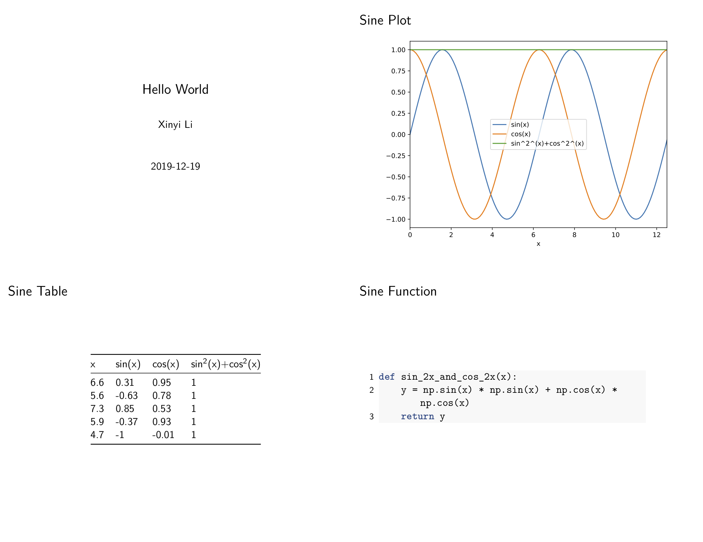

做了一个可以自己定制md模板，并在每次运行程序化自动生成相应报告的库。现已发布到pypi，欢迎试用。

- 实现原理初步构想： https://zhuanlan.zhihu.com/p/96675335
- GitHub项目主页：https://github.com/li-xin-yi/HK-journalist
- 完整文档地址：https://hk-journalist.readthedocs.io/en/latest/

```
pip install hkjournalist
```
## Features
- 可以自己用Markdown写报告的生成模板，这对于熟悉md写作的人比较友好
- 生成的pdf报告为slide形式，可以直接投影讲解给其他合作者，自己阅读也方便。同时保证了图片的矢量性和高品质，文件大小也十分轻量。
- 可以自动在输出文件名上加上时间戳，形成多次改动的snapshot效果，这对于频繁调参的使用者来说非常有用。
- 支持plot，dataframe，函数，字符串列表这四种特殊类型在报告中以更加优雅容易阅读的形式呈现
- **可以自动根据需要report的变量类型生成模板**。再也不用担心懒得写markdown模板的问题了。
- 除了维护存储变量名-值映射关系的dict，用以生成报告的Python代码只需要3-4行

## Demo
一个非常简单的例子，自己写一个类似这样的报告模板，遵循一般的markdown语法，除了用{}包裹了变量名，让它在程序运行时由运行环境来决定。
````
% Hello World
% Xinyi Li
% 2019-12-19

---

### sine plot


### sine table

{sin_table}

### sine function

```{{.python}}
{sin_func}
```
````

也就是说变量`sin_plot`, `sin_table`, `sin_func`都需要在你的python程序中获取。获取的方法是定义一个dict来保存它们的名字和真实值之间的映射关系：

```py
from hkjournalist import Journalist

config = {}
```

接下来开始你的表演，及时的把它们的值绑定对应的变量名：
```py
def sin_2x_and_cos_2x(x):
    y = np.sin(x) * np.sin(x) + np.cos(x) *  np.cos(x)
    return y

x = np.arange(0, 4 * np.pi, 0.1)
y1 = np.sin(x)
y2 = np.cos(x)

df = pd.DataFrame({'x': x, 'sin(x)': y1, 'cos(x)': y2})
df['sin^2^(x)+cos^2^(x)'] = sin_2x_and_cos_2x(df['x']).values
df = df.set_index('x')

# plot sine curve as sin_plot
ax = df.plot()
plt.tight_layout()
config['sin_plot'] = ax

# random select 5 point (x,y) as sin_table
config['sin_table'] = df.sample(5)

# sin_2x_and_cons_2x as sin_func
config['sin_func'] = sin_2x_and_cos_2x
```

最后添加3行关键代码

```py
reporter = Journalist(template_file='template.md')
reporter.hear(config)
reporter.report(output_file='big_news.pdf', beamer=True, overwrite=True)
```
然后你就可以看见最终的pdf报告

原始的pdf文件可以去github对应目录下查看，上面已经把4页打印在一起了。
最后祝您使用愉快，程序跑的比谁都快。
