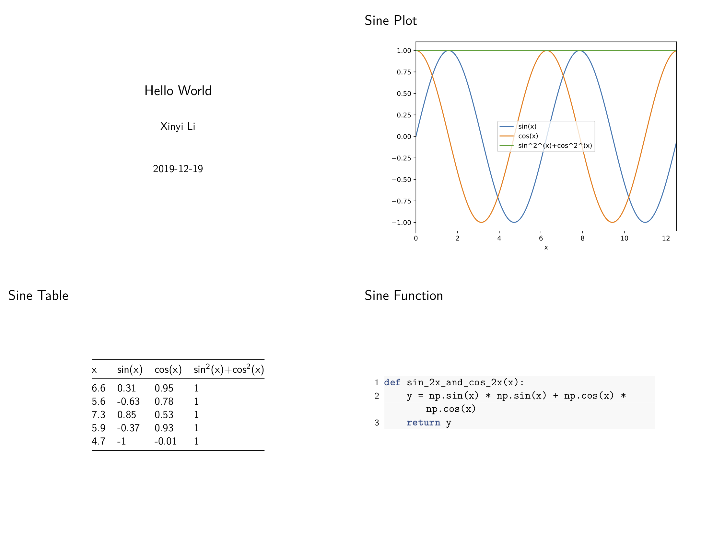

# HK-journalist: Custom Automatic Report Generator for Python program!

It is a useful Python module, help you generate a small size, pretty report as PDF slides (or any other format documents which human can directly read and hand out) each time after your programs finish. All you need to customize your report is to customize a report template using `MarkDown` with variables name which used in your Python program, and maintain a `dict` to store those variables. Then, A few lines of code added before end of programs can automatically fetch and display them in final report file. Also, code deal with frequent structure/arguments changes or data source changes can benefit from the package if the report can play a role of 'snapshot' (with timestamp) of each code version.

## Quick Start

Before installing `hkjournalist`, please make sure `pandoc` and `pdflatex` are already properly installed in the environment. ([install instruction](#prerequirements))

### install

```
pip install hkjournalist
```

### Customize your report template

Write such a `md` file, use a pair of `{}` to wrap every variable which will be assigned specified value in your code. save it to `template.md`

````
% Hello World
% Xinyi Li
% 2019-12-19

---

### sine plot


### sine table

{sin_table}

### sine function

```{{.python}}
{sin_func}
```

````

### Run a Journalist() in your code to fetch variables

First, you should define a `dict` to record mapping with variable names and their value

```py
from hkjournalist import Journalist

config = {}
```


Then, start your programming, and do not forget to assign value to corresponding variable names in `config`:
```py
import matplotlib.pyplot as plt
import numpy as np
import pandas as pd

def sin_2x_and_cons_2x(x):
    y = np.sin(x) * np.sin(x) + np.cos(x) *  np.cos(x)
    return y

x = np.arange(0, 4 * np.pi, 0.1)
y1 = np.sin(x)
y2 = np.cos(x)

df = pd.DataFrame({'x': x, 'sin(x)': y1, 'cos(x)': y2})
df['sin(x^2^)+cos(x^2^)'] = sin_2x_and_cons_2x(df['x']).values
df = df.set_index('x')

# plot sine curve as sin_plot
ax = df.plot()
plt.tight_layout()
config['sin_plot'] = ax

# random select 5 point (x,y) as sin_table
config['sin_table'] = df.sample(5)

# sin_2x_and_cons_2x as sin_func
config['sin_func'] = sin_2x_and_cons_2x
```

### Invite a journalist to make a big news report

Last but not least, attach 3 lines **critical** code below to have your `Journalist` make a report and save it to `big_news.pdf` (you can get all code above in [demo](./demo) and the output file [big_news.pdf](./demo/big_news.pdf))

```py
# HK journalist runs faster than everyone! hear variable and make a report
reporter = Journalist(template_file='template.md')
reporter.hear(config)
reporter.report(output_file='big_news.pdf', beamer=True, overwrite=True)
```

Report slides shows as below:


## I am too lazy to write a `md` template

If you have too many variables to report, which make write a template a big project, or simply don't want to write a `md` template, **No problem!** `hkjournalist` can generate a report template with each variable on one slide page automatically. With slightly modification or directly used it as a template, you can get your report.

**Example**
```py
import numpy as np
import matplotlib.pyplot as plt
import seaborn as sns
from hkjournalist import Journalist

sns.set(style="darkgrid")

config = {}

for i in range(1, 4):
    uniform_data = np.random.rand(10, 12)
    plt.figure(figsize=(10, 8))
    ax = sns.heatmap(uniform_data, cmap='Blues', annot=True)
    plt.tight_layout()
    config[f'plot_{i}'] = ax

reporter = Journalist(fig_height='80%')
reporter.hear(config)
reporter.generate_template('auto_generate_template.md')
reporter.report(output_file='auto_report.pdf', beamer=True, overwrite=True)
```
Output (you can also view [raw file](./demo/  auto_report.pdf)):


## More examples and instructions

- More complex usages available in [examples](./examples)
- How to write a complicated slide template using `md`？ See [pandoc tutorials](https://pandoc.org/MANUAL.html#producing-slide-shows-with-pandoc)

## Tips

- before pass `plt.Axes` object (figure object used in `matplotlib`) to `dict`, use `plt.tight_layout()`statement to adjust its size.
- use double curly braces `{{}}` to escape `{}` in template.
- turn off parameter `overwrite` in `Journalist.report()`, you will get a file name with a timestamp in it. All these reports generated by such a method serve as snapshots.


## prerequirements

- `pandoc`: https://pandoc.org/installing.html
- `texlive`/`mactex`(for MacOS): https://www.tug.org/texlive/ http://www.tug.org/mactex/

And if you use some IDE like PyCharm, you need to add their path (use `which tex` and `which pandoc` in bash environment to find them) to environment variables `$PATH` in IDE run options. (e.g. in Pycharm,`run`-> `edit configuration` -> `environment variables`)

For [Jupyter Notebook](https://jupyter.org/) users, final output file may not be opened on Chrome (see [this question](https://stackoverflow.com/questions/55251691/how-to-open-pdf-file-in-jupyter-file-browser)). So, for convenience, you can download [Firefox](https://www.mozilla.org/en-US/firefox/new/) to write notebooks and view pdf reports right after generating.

## README todo list

- [ ] support types demonstrate
- [ ] documents of each method
