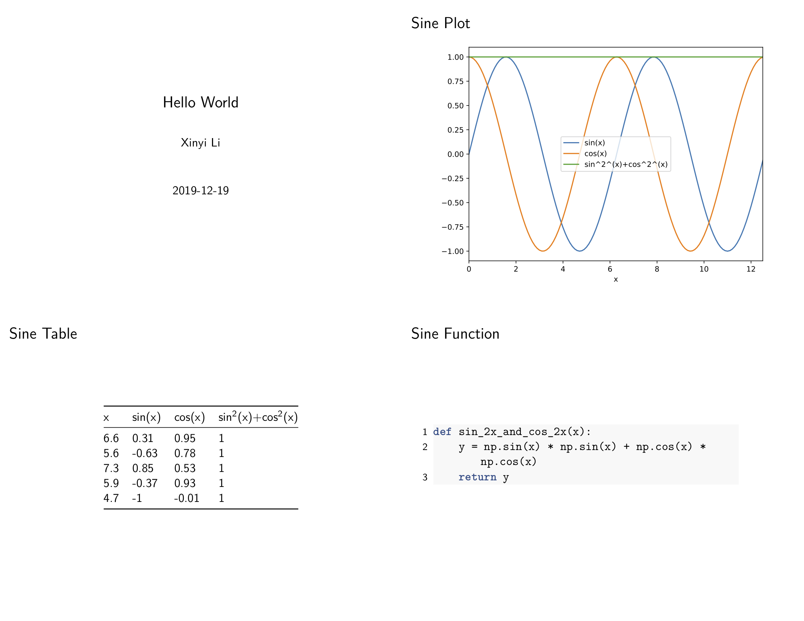

# Quick Start

## Pre-requirements

Before installing `hkjournalist`, please make sure `pandoc` and `pdflatex` are already properly installed in the environment.

- `pandoc`: [pandoc.org/installing.html](https://pandoc.org/installing.html)
- `texlive`/`mactex`(for MacOS): [www.tug.org/texlive/ http://www.tug.org/mactex/](https://www.tug.org/texlive/ http://www.tug.org/mactex/)

## Install

```
pip install hkjournalist
```

## Customize your report template

Write such a `md` file, use a pair of `{}` to wrap every variable which will be assigned specified value in your code. save it to `template.md`

````md
% Hello World
% Xinyi Li
% 2019-12-19

---

### sine plot


### sine table

{sin_table}

### sine function

```{{.python}}
{sin_func}
```

````

## Run a `Journalist()` in your code to fetch variables

First, you should define a `dict` to record mapping with variable names and their value

```py
from hkjournalist import Journalist

config = {}
```


Then, start your programming, and do not forget to assign value to corresponding variable names in `config`:
```py
def sin_2x_and_cos_2x(x):
    y = np.sin(x) * np.sin(x) + np.cos(x) *  np.cos(x)
    return y

x = np.arange(0, 4 * np.pi, 0.1)
y1 = np.sin(x)
y2 = np.cos(x)

df = pd.DataFrame({'x': x, 'sin(x)': y1, 'cos(x)': y2})
df['sin^2^(x)+cos^2^(x)'] = sin_2x_and_cos_2x(df['x']).values
df = df.set_index('x')

# plot sine curve as sin_plot
ax = df.plot()
plt.tight_layout()
config['sin_plot'] = ax

# random select 5 point (x,y) as sin_table
config['sin_table'] = df.sample(5)

# sin_2x_and_cons_2x as sin_func
config['sin_func'] = sin_2x_and_cos_2x
```

## Invite a journalist to make a big news report

Last but not least, attach 3 lines **critical** code below to have your `Journalist` make a report and save it to `big_news.pdf` (you can get all code above in [demo](https://github.com/li-xin-yi/HK-journalist/tree/master/demo) and the output file [big_news.pdf](https://github.com/li-xin-yi/HK-journalist/blob/master/demo/big_news.pdf))

```py
# HK journalist runs faster than everyone! hear variable and make a report
reporter = Journalist(template_file='template.md')
reporter.hear(config)
reporter.report(output_file='big_news.pdf', beamer=True, overwrite=True)
```

Report slides display as below:


## Final question: What will my variables on slides look like?

All variables pass to `Journalist` via `hear` will display as strings just like what their `__str__` method do.

Except for 4 types with special support:

- `pandas.DataFrame`: -> a 3-line table (`TeX` default style)
- `matplotlib.axes.SubplotBase` (known as base figure object `ax` in `matplotlib`):  -> a figure print on report (with high quality and small size as `pdf`)
- `function`: -> its full definition
- `list(str)`: -> `len(list)` followed by a sentance with all words concatenated.
