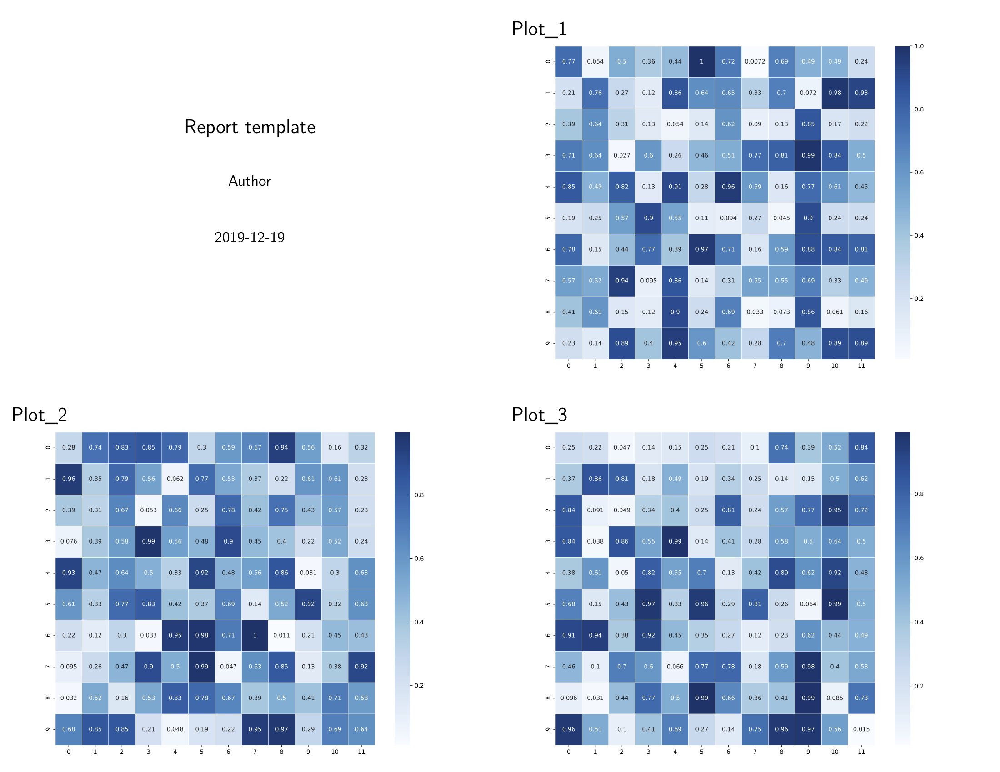

# Auto Generate `md` Template

## I am too lazy to write a `md` template

If you have too many variables to report, which make write a template a big project, or simply don't want to write a `md` template, **No problem!** `hkjournalist` can generate a report template with each variable on one slide page automatically. With slight modification or directly using it as a template, you can get your real report.

## Example

```py
import numpy as np
import matplotlib.pyplot as plt
import seaborn as sns
from hkjournalist import Journalist

config = {}

for i in range(1, 4):
    uniform_data = np.random.rand(10, 12)
    plt.figure(figsize=(10, 8))
    ax = sns.heatmap(uniform_data, cmap='Blues', annot=True, linewidth=.5)
    plt.tight_layout()
    config[f'Plot_{i}'] = ax

reporter = Journalist(fig_height='80%')
reporter.hear(config)
reporter.generate_template('auto_generate_template.md')
reporter.report(output_file='auto_report.pdf', beamer=True, overwrite=True)
```
Output ([raw file](https://github.com/li-xin-yi/HK-journalist/blob/master/demo/auto_report.pdf) ):


