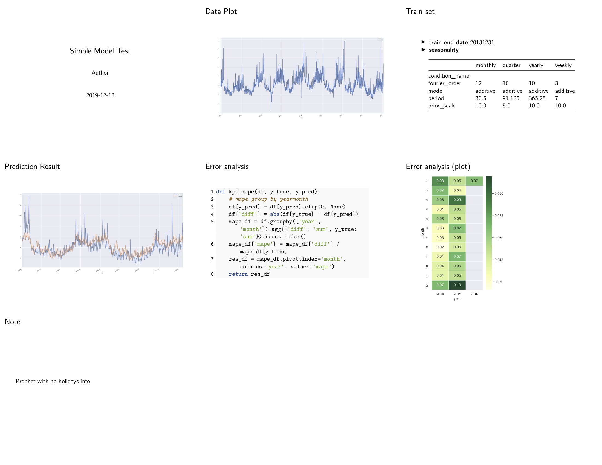

# Tutorial 1: Run a prophet model on time series

- Code and output: [example/1\_prophet\_model\_evalute.py](https://github.com/li-xin-yi/HK-journalist/blob/master/examples/1_prophet_model_evaluate.py)
- Data and model usage from [`fbprophet` tutorials](https://facebook.github.io/prophet/docs/quick_start.html#python-api)


## Prepare a `dict` to store variables

```py
import pandas as pd
import matplotlib.pyplot as plt
import seaborn as sns
from hkjournalist import Journalist
from fbprophet import Prophet

sns.set(style="darkgrid")

# maintain a dict to record all variables used in reports
config = {}
```

## Load data

```py
df = pd.read_csv('./data/example_wp_log_peyton_manning.csv')
df['ds'] = pd.to_datetime(df['ds'])
```

## Plot data

```py
ax = df.set_index('ds').plot(figsize=(20, 10))
plt.tight_layout()
config['data_plot'] = ax
```

## Split train and test set

```py
train_end_date = '20131231'
config['train_end_date'] = train_end_date
train_df = df[df['ds'] <= train_end_date]
test_df = df[df['ds'] > train_end_date]

test_df['year'] = test_df['ds'].dt.year
test_df['month'] = test_df['ds'].dt.month
```

## Build a model

```py
model = Prophet(weekly_seasonality=True, yearly_seasonality=True)
model.add_seasonality('monthly', period=30.5, fourier_order=12, prior_scale=10)
model.add_seasonality('quarter', period=364.5 / 4, fourier_order=10, prior_scale=5)
```
Seasonalities are import hyper-parameters of a `Prophet` model, which should be recorded every time.

## Fit this model and plot the prediction

The final plot should also be reported.

```py
model.fit(train_df)
config['seasonality'] = pd.DataFrame(model.seasonalities)
test_df['y_pred'] = model.predict(test_df[['ds']])['yhat'].values
ax = test_df[['ds', 'y', 'y_pred']].set_index('ds').plot(figsize=(20, 10))  # plot predict result
plt.tight_layout()
config['pred_plot'] = ax
```

## Define a custom metric to evaluate model

And the metric definition should be exposed to others

```py
def kpi_mape(df, y_true, y_pred):
    # mape group by yearmonth
    df[y_pred] = df[y_pred].clip(0, None)
    df['diff'] = abs(df[y_true] - df[y_pred])
    mape_df = df.groupby(['year', 'month']).agg({'diff': 'sum', y_true: 'sum'}).reset_index()
    mape_df['mape'] = mape_df['diff'] / mape_df[y_true]
    res_df = mape_df.pivot(index='month', columns='year', values='mape')
    return res_df

config['metric_func'] = kpi_mape
```

## Detail data for error analysis

```py
kpi_df = kpi_mape(test_df, 'y', 'y_pred')
plt.figure(figsize=(4, 6))
ax = sns.heatmap(kpi_df, annot=True, cmap='YlGn', linewidth=.5, fmt='.2f')
plt.tight_layout()
config['error_plot'] = ax
```

## Add some personal note to describe your model

```py
config['note'] = "Prophet with no holidays info"
```


## Finally, here comes the `Journalist`!

```py
report_journalist = Journalist(template_file='./reports/1_prophet_report_template.md')
report_journalist.hear(config)
report_journalist.report(output_file='./reports/1_prophet_report.pdf', beamer=True, overwrite=False)
```

## Output slides

raw file: [examples/reports/1_prophet_report_2019-12-18_22:06:18.pdf](https://github.com/li-xin-yi/HK-journalist/blob/master/examples/reports/1_prophet_report_2019-12-18_22:06:18.pdf)


