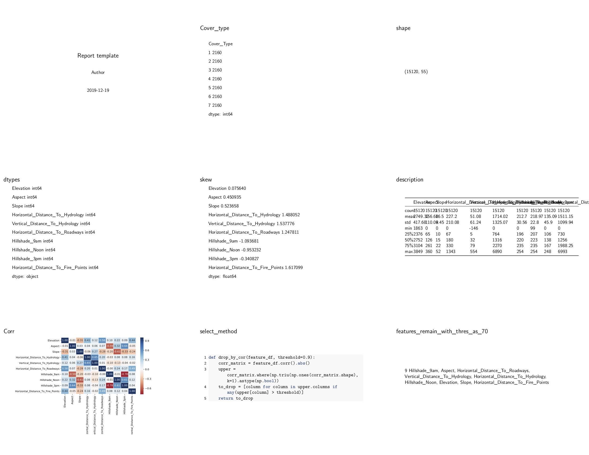

# Tutorial 2: EDA and select feature

- Code and output: [example/2\_feature\_selection.py](https://github.com/li-xin-yi/HK-journalist/blob/master/examples/2_feature_selection.py)
- Data from [Kaggle Contest](https://www.kaggle.com/c/forest-cover-type-prediction/data)


## Load Data and pass basic statistics data to `config`

```py
import numpy as np
import pandas as pd
import matplotlib.pyplot as plt
import seaborn as sns
from hkjournalist import Journalist

config = {}

df = pd.read_csv('./data/train.csv')
df = df.iloc[:, 1:]
feature_df = df.loc[:, :'Horizontal_Distance_To_Fire_Points']

# basic statistics feature
config['Cover_type'] = df.groupby('Cover_Type').size()
config['shape'] = df.shape
config['dtypes'] = feature_df.dtypes
config['skew'] = feature_df.skew()
config['description'] = feature_df.describe()
```

## Plot the correlation matrix

```py
data_corr = feature_df.corr()
plt.figure(figsize=(8, 6))
grid = sns.heatmap(data_corr, annot=True, fmt='.2f', cmap='RdBu', center=0, linewidth=.5)
plt.tight_layout()
config['Corr'] = grid
```

## Filter features with high correlation coefficient

```py
def drop_by_cor(feature_df, threshold=0.9):
    corr_matrix = feature_df.corr().abs()
    upper = corr_matrix.where(np.triu(np.ones(corr_matrix.shape), k=1).astype(np.bool))
    to_drop = [column for column in upper.columns if any(upper[column] > threshold)]
    return to_drop


config['select_method'] = drop_by_cor
threshold = 0.7

valid_features = list(set(feature_df.columns) - set(drop_by_cor(feature_df, threshold)))
config[f'features_remain_with_thres_as_{int(threshold * 100)}'] = valid_features
```

Too many variables to write a template by hand? don't worry, just call `generate_template` method!

## HKJournalist can use auto-generated template before making a big report!

```py
report_journalist = Journalist()
report_journalist.hear(config)
report_journalist.generate_template('./reports/2_feature_select_template.md')
report_journalist.report('./reports/2_feature_select.pdf', overwrite=True, beamer=True, aspectratio=169)
```

## Output

raw file: [./reports/2_feature_select.pdf](https://github.com/li-xin-yi/HK-journalist/blob/master/examples/reports/2_feature_select.pdf)


