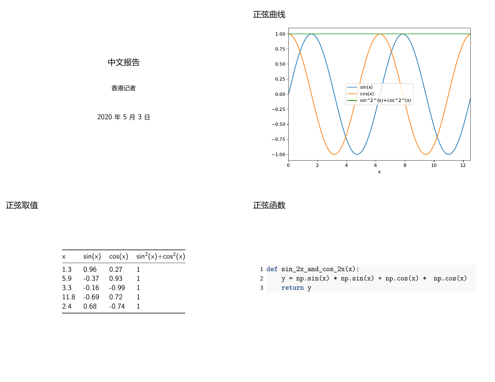

# Write templates with Chinese characters

*(new feature from 0.0.5)*

Now, `HKJournalist` can generate reports from templates that contain Chinese Characters. In other words, we can write reports using `zh_CN`.

## Pre-requirements

First of all, you should check if [XeLaTeX](https://www.tug.org/xetex/) is installed properly in your environment. It is always integrated in [TeXLive](https://www.tug.org/texlive/) /[MacTeX](https://tug.org/mactex/).

Then, make sure you have already installed target Chinese fonts.

## Specify the header in `md` template

In the YAML metadata block, you should specify the CJK font used by the report. To simplify, For slides, we just specify `documnetclass` in which the font is already defined: *(it is what exactly `HKJournalist` do when asked to automatically give a chinese report template)*


```yaml
---
documentclass: ctexbeamer
title: 中文报告
author: 香港记者
date: \today{{}}
---
```

Or you can replace the first line with a font declaration, such as:

```yaml
# for windows
CJKmainfont: KaiTi
# Or for Linux
mainfont: WenQuanYi Micro Hei Mono
```

**Note**: the line about font or `documentclass` should be placed at first in the block.

**Note**: `\today{}` is a command that will be replaced by the actual date in proper format in the final report. To escape `{}`, it should be as `\today{{}}` in a template.

## Write main part of your program

In general, there is nothing noteworthy in this part. Codes used in this example is exactly the same as the one in [Quick Start](./quick-start.md).

```python
import numpy as np
import pandas as pd
import matplotlib.pyplot as plt
from hkjournalist import Journalist

config = {}


def sin_2x_and_cos_2x(x):
    y = np.sin(x) * np.sin(x) + np.cos(x) * np.cos(x)
    return y


x = np.arange(0, 4 * np.pi, 0.1)
y1 = np.sin(x)
y2 = np.cos(x)

df = pd.DataFrame({'x': x, 'sin(x)': y1, 'cos(x)': y2})
df['sin^2^(x)+cos^2^(x)'] = sin_2x_and_cos_2x(df['x']).values
df = df.set_index('x')

# plot sine curve as sin_plot
ax = df.plot()
plt.tight_layout()
config['sin_plot'] = ax

# random select 5 point (x,y) as sin_table
config['sin_table'] = df.sample(5)

config['sin_func'] = sin_2x_and_cos_2x
```

However, you should always be careful on the encoding of your code/text files, especially when chinese characters probably occur in strings. Please ensure your files are always read and written under `UTF-8` encoding.

And the rest part of [`md` template](https://github.com/li-xin-yi/HK-journalist/blob/master/examples/reports/3_zh_cn_template.md) is:

```markdown
### 正弦曲线


### 正弦取值

{sin_table}

### 正弦函数

```{{.python}}
{sin_func}
```


## Turn on `zh`

When constructing a `HKJournalist` instance, Turn on its `zh-CN` support by using `zh=True` argument.

```python
reporter = Journalist(template_file='./reports/3_zh_cn_template.md', zh=True)
```

It is not too late to set `reporter.zh=True` by hand before call its `report()` method, of course, if you rely on automatically generated template with `generate_template()`, its `zh` property must be determined more early.

## Final report

The following steps are as usual:

```python
reporter.hear(config)
reporter.report(output_file='./reports/3_zh_report.pdf', beamer=True, overwrite=True)
```

The output file [3_zh_report.pdf](https://github.com/li-xin-yi/HK-journalist/blob/master/examples/reports/3_zh_report.pdf) looks like:


